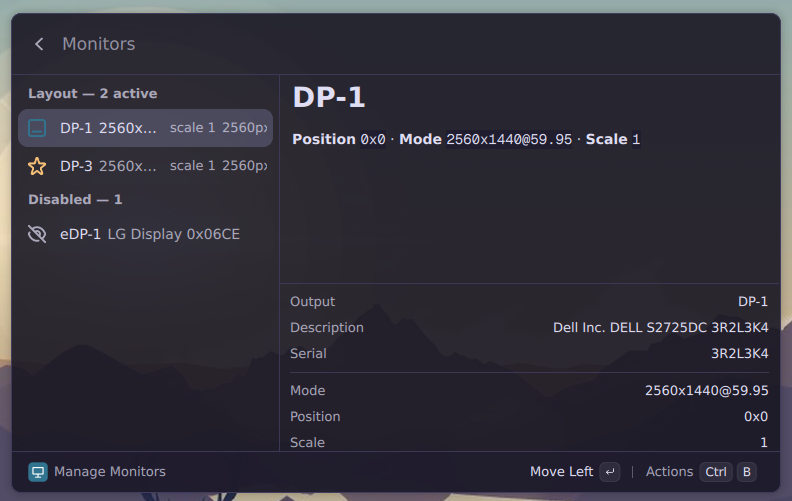

# Hyprland Display Arranger

Arrange Hyprland displays from the Vicinae launcher. Reorder, position, enable, and persist external displays without hand-editing your config.

## Features

- Reorder displays with `Ctrl+H` / `Ctrl+L`, applied instantly
- Exact X/Y positioning, per-display scale and mode info
- Enable/disable displays (never the last active one)
- Layouts persist across reboots via an owned sidecar file
- Stable `desc:` matching — identical panels keep their sides when the kernel renumbers outputs

## Requirements

- Hyprland 0.55+ with a Lua config (`hyprland.lua`)
- Vicinae launcher
- `hyprctl` on `PATH`

## Install

1. `npm install`
2. `npm run build`

## Usage

Open Vicinae, run **Arrange Displays**, pick a display.

Every change applies instantly and rewrites `displays-vicinae.lua`, which your `hyprland.lua` loads last via a single `require` line (added automatically on first change). Your existing rules are imported, never edited. **Remove Extension Config** deletes the sidecar and the require lines.

## Develop

`npm run dev` (Vicinae running, hot-reload on save)
