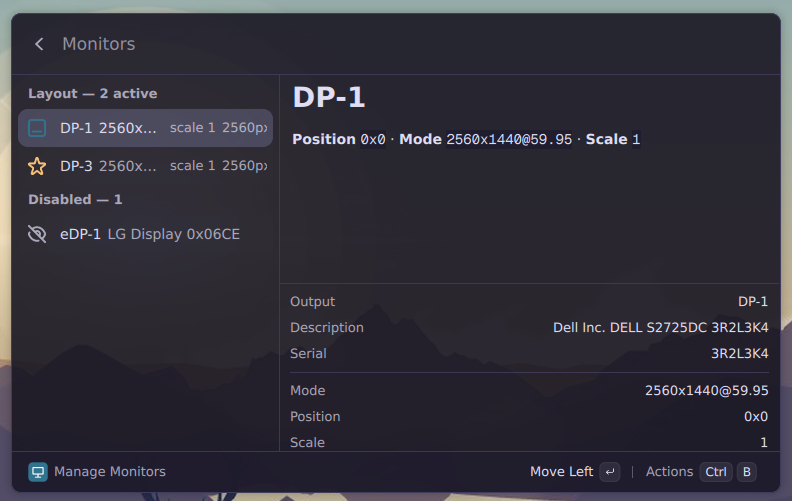

# Hyprland Display Arranger

Arrange Hyprland displays from the launcher. Reorder, position, and toggle displays — layouts persist across reboots.

## Features

- Reorder displays with `Ctrl+Left` / `Ctrl+Right`
- Set exact positions, including negative Y for stacked setups
- Enable / disable displays with `Ctrl+D`
- Native resolution at max refresh, re-detected on every change
- Per-location memory — each setup restores when you plug back in
- Live list — plug / unplug shows up within ~2 seconds
- One-click diagnostics copy for bug reports

## Requirements

Hyprland 0.55+ with `hyprland.lua`, Vicinae, `hyprctl` on `PATH`.

Install with `npm install` + `npm run build`.
